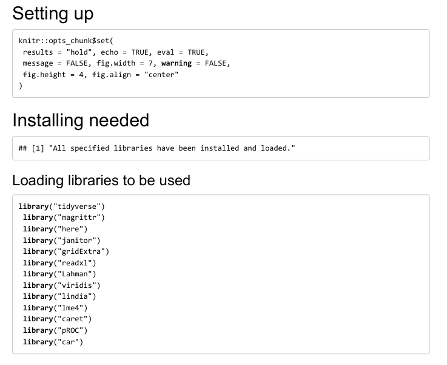
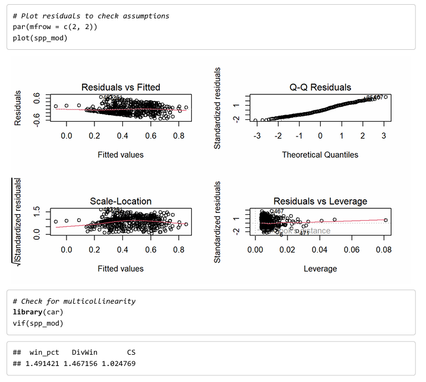
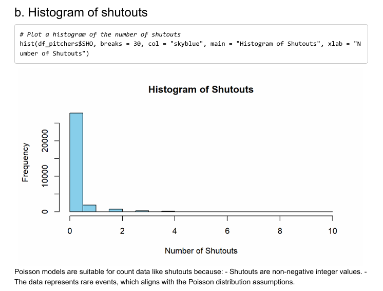
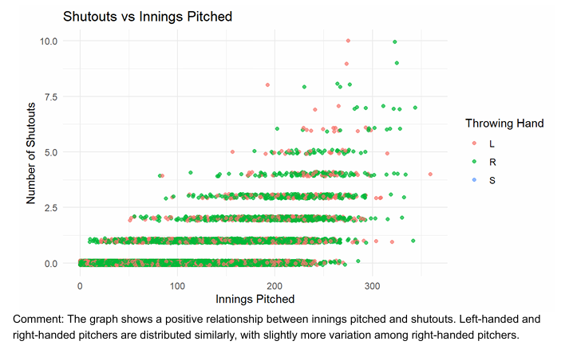

# 📊 Statistical Modelling – Baseball Manager & Player Analysis

This project applies statistical modeling techniques to baseball data from the **Lahman** R package. It covers:

- Linear regression to predict manager award performance
- Logistic regression on the decline of player-managers
- Poisson regression to analyze pitcher shutouts

---

## 🔧 Tools & Libraries

- **Language**: R
- **Libraries**: `tidyverse`, `lme4`, `car`, `pROC`, `ggplot2`, `Lahman`

---

## 1️⃣ Linear Regression: Manager Award Score

### 🎯 Goal
Predict a transformed award score (`sqr_point_pct`) using:

- Win percentage (`win_pct`)
- Division wins (`DivWin`)
- Championship Series appearances (`CS`)

### 🧠 Model

```r
sqr_point_pct = -0.73 + 1.81*win_pct + 0.14*DivWinY + 0.003*CS
```

- All predictors are statistically significant
- R² = 0.27 (moderate fit)

### 📈 Diagnostic Plots



---

## 2️⃣ Logistic Regression: Player-Manager Status Over Time

### 🎯 Goal
Model the probability of being a player-manager (`plyrMgr`) based on `yearID`.

```r
logit(p) = 88.60 - 0.05 * yearID
```

- Shows a significant decline in player-managers over time

### 📊 ROC Curve (Train vs. Test)



### 📉 Confusion Matrix & Performance



- **Youden's Index** ≈ 0.44 (moderate classification)
- Good specificity, lower sensitivity

### 🏷️ Performance by League (lgID)



---

## 3️⃣ Poisson Regression: Pitcher Shutouts

### 🎯 Goal
Model shutouts (`SHO`) using:

- Innings pitched
- Height
- Weight
- Throwing hand

### 🔍 Key Insights

- More innings = more shutouts
- Heavier pitchers tend to pitch fewer shutouts
- Left-handed pitchers pitch ~13% more shutouts

---

